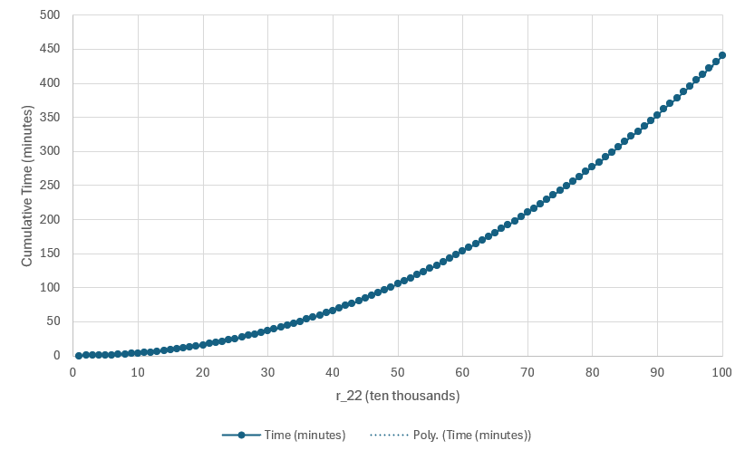

# ParkerSquare
Searching for magic-squares-of-squares

## Results so far

If a magic square of squares exists, its middle value is at least $10^{12}$ and the common sum of its rows, columns, and diagonals is at least $3 \times 10^{12}$.

## Background

This repository contains code to search for magic squares of squares. These squares were made popular recently by a series of Numberphile videos starting in [2016](https://www.youtube.com/watch?v=aOT_bG-vWyg) where one failed attempt was cristened the "Parker square". The topic was [revisted](https://www.youtube.com/watch?v=stpiBy6gWOA) in 2025 and a US \$10,000 bounty was placed on the first successful finding of such a square. (Note, however, that many mathematicians suspect these squares do not exist.)

Magic squares are $3 \times 3$ grids of positive integers,
```math
\begin{matrix}
x_{11} & x_{12} & x_{13} \\
x_{21} & x_{22} & x_{23} \\
x_{31} & x_{32} & x_{33}
\end{matrix}
```
where all integers are unique and the three rows, three columns, and two main diagonals have the same sum, $T$. Magic squares of squares have the additional property that each $x_{ij}$ is also a square, $x_{ij} = r_{ij}^2$ for $r_{ij} \in \mathbb{N}$.

## The search

### The main idea ($k$)

The search employed here revolves around the central value, $x_{22}$, and its square root, $r_{22}$. Consider all sums passing through $x_{22}$: the second row, second column, and both diagonals. Subtracting $x_{22}$ from each reveals a common constant we call $k$,

$$
k = x_{11} + x_{33} = x_{12} + x_{32} = x_{13} + x_{31} = x_{21} + x_{23}.
$$

We note several interesting and useful properties of $k$. 

First, directly from the above equation, $k$ must be expressable as the sum of two squares in at least four unique ways. We call this a Quadruple Sum of Squares (QSS).

Second, $k = 2r_{22}^2$. Consider the relationship between $k$ and the common sum of the square, $T$. The first and third rows of the magic square, together, comprise exactly three copies of $k$ and exactly two copies of $T$. Therefore $T = 3k/2$. Now considering one sum containing $x_{22}$, we see

$$
T = x_{11} + x_{22} + x_{33} = x_{22} + k.
$$

Therefore $x_{22} = k/2$ and $k$ must also be twice a perfect square, specifically, $k = 2r_{22}^2$.

Third, with $r_{22}$, $k$, and all pairs of square numbers which sum to $k$, it is relatively easy to try all permutations and check for the desired magic square. All eight values on the permiter of the magic square are involved in a sum with its opposite to equal $k$.

### Details of the search algorithm

The algorithm has the following general steps:

For $r_{22} = 1,2,\dots$
1. Set $k = 2r_{22}^2$.
2. Determine if $k$ can be written as a sum of squares in at least 4 unique ways.
    - If not, continue to next $r_{22}$.
3. Find all unique $(a_i, b_i)$, with $0 < a_i < b_i$, with $a_i,b_i$ square, and $a_i + b_i = k$.
4. Try combinations of $(a_i, b_i)$ for the diagonal and second column sums to complete the top and bottom rows with common sum $T$.
    - If unsuccessful, continue to next $r_{22}$.
5. With a completed top and bottom row, and known $T$, fill in the middle row so each column sums to $T$ and check if the filled in values are perfect squares.
    - If unsuccessful, continue to next $r_{22}$.
    - If successful, you've won \$10,000.
  
#### Steps 2 and 3 - finding Quadruple Sums of Squares (QSS)

The naive way of performing these steps would be to simply skip straight to step 3: find all pairs of squares that add to $k$ and check if there are at least 4 such pairs. This isn't a terrible approach as this search can be completed in ${\cal O}(\sqrt{k})$ time, and needs to be done if $k$ is a QSS anyway. Starting with $i = 1$ and continuing until $i^2 >= k/2$, determine if $k - i^2$ is a perfect square. In total, approximately $\sqrt{k/2}$ checks for squareness must be performed. As implemented, we can be slightly more efficient by maintaining four variables, initialized as `a = 1`, `asquared = 1`, `b = isqrt(k - asquared)`, `bsquared = b * b`, and "walking" them towards each other and noting any instances when `k = asquared + bsquared`.

However, we can still do better via a more efficient check for QSS-ness before enumerating all pairs. We do this check based on [Jacobi's two-square theorem](https://en.wikipedia.org/wiki/Sum_of_two_squares_theorem#Jacobi's_two-square_theorem). This theorem states that the number of ways in which a number can be written as the sum of two squares can be determined from its prime factorization. At first, this might not seem beneficial. A naive algorithm for prime factorization of a number $n$ takes ${\cal O}(\sqrt{n})$ time, the same time complexity as finding all pairs of squares directly. But we can take advantage of the fact that $k$ has the form $k = 2r_{22}^2$ by finding the prime factorization of $r_{22}$ and then easily producing the prime factorization of $2r_{22}^2$. This then only has time complexity ${\cal O}(\sqrt{r_{22}}) = {\cal O}(k^{1/4})$. In practice, we find that about 25%-30% of all $k$ are QSS, reducing the time required by 70%-75% over the long run.

#### Steps 4 and 5 - filling in the magic square

We start these steps with a value for $k$, and at least four pairs of squares $(a_i, b_i)$ with $a_i < b_i$ and $a_i + b_i = k$. Let $(a_1,b_1)$ be the pair on the top left to bottom right diagonal, and $(a_2,b_2)$ be the pair on the top right to bottom left diagonal. By reflectional and rotational symmetry of the magic square, we can always orient the square such that the smaller of each pair is in the top row and the top left corner is smaller than the top right corner. So without loss of generality, let $a_1 < a_2 < b_2 < b_1$. The magic square now looks like this:
```math
\begin{matrix}
a_1 & \cdot & a_2 \\
\cdot & \cdot & \cdot \\
b_2 & \cdot & b_1
\end{matrix}
```
Now we let $(a_3, b_3)$ be be the pair in the center column. Because we know that the top and bottom rows must have the same sum, then $b_3$ is in the top row and $a_3$ is in the bottom row, otherwise the top row would obviously have a smaller sum than the bottom row. Placing this pair completes the top and bottom rows:
```math
\begin{matrix}
a_1 & b_3 & a_2 \\
\cdot & \cdot & \cdot \\
b_2 & a_3 & b_1
\end{matrix}
```
The top row sum can now be written as $a_1 + b_3 + a_2 = a_1 + (k - a_3) + a_2 = 3k/2$. Then, $a_1 - a_3 = k/2 - a_2 > 0$, so $a_3 < a_1$. We now have a complete ordering of $a_3 < a_1 < a_2$.

With this ordering, we can iterate over every combination of three pairs $(a_i, b_i)$, placing them in the top and bottom rows and checking for equal sums. If the sums are equal, we can complete the middle row by using the known common sum and checking for the squareness of each number in the middle row. If all numbers in the middle row are square, the magic square is complete.

## Emperical performance and runtime

The first one million values of $r_{22}$, and therefore all values of $k$ up to $2 \times 10^{12}$, where checked on my personal laptop, single-threaded, in approximately 7.5 hours. The overall time complexity for checking all values of $r_{22}$ up to $N$ appears to be quadratic. If you're a glass half-full kind of person, you could say the overall time complexity of checking all values of $x_{22}$ up to $N$ is linear.


